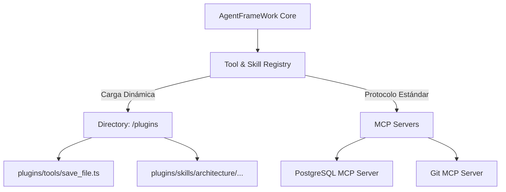

# Arquitectura de Plugins Desacoplables y Model Context Protocol (MCP)

Este documento detalla el diseño técnico para transformar el directorio `plugins/` de un elemento decorativo a la base de un framework altamente modular y desacoplado, permitiendo especializar al agente para múltiples industrias sin contaminar el `core` del framework.

---

## 🎯 Visión Arquitectónica

El núcleo (`core`) de `AgentFrameWork` debe actuar estrictamente como un **Orquestador Afecto al Estado** (State-Bound Orchestrator). Sus únicas responsabilidades son:
1. Gestionar el ciclo de vida del agente (`AgentKernel`).
2. Resolver el estado (`StateResolver`).
3. Construir el contexto y el prompt (`ContextBuilder`, `PromptBuilder`).
4. Ejecutar el bucle de razonamiento de N pasos (`FlowEngine`).

Toda capacidad interactiva (lectura de archivos, consultas a base de datos, APIs de terceros, comandos) debe ser un **Plugin externo** cargado en tiempo de ejecución.



---

## 📋 Diseño del Cargador de Plugins (`PluginLoader`)

Para evitar tener herramientas como `ReadFileTool` importadas físicamente en `AgentFactory.ts`, implementaremos un cargador dinámico de plugins:

```typescript
export class PluginLoader {
  public static async loadTools(pluginsDir: string, registry: ToolRegistry): Promise<void> {
    const fs = await import('fs');
    const path = await import('path');

    if (!fs.existsSync(pluginsDir)) return;

    const files = fs.readdirSync(pluginsDir);
    for (const file of files) {
      if (file.endsWith('.ts') || file.endsWith('.js')) {
        const modulePath = path.resolve(pluginsDir, file);
        const pluginModule = await import(modulePath);
        
        // Asumiendo export por defecto de la clase de la herramienta
        if (pluginModule.default) {
          const toolInstance = new pluginModule.default();
          registry.register(toolInstance);
        }
      }
    }
  }
}
```

---

## 🔌 Soporte de MCP (Model Context Protocol)

El protocolo **MCP** (creado por Anthropic) es la solución estándar de la industria para evitar crear plugins propietarios en cada framework. MCP permite conectar el agente a servidores de herramientas locales o remotos mediante JSON-RPC sobre Stdio o SSE.

### Diseño de Integración MCP en `AgentFrameWork`:
1. **Configuración de Servidores**: Se define un archivo `mcp-config.json` en el proyecto:
   ```json
   {
     "mcpServers": {
       "postgres": {
         "command": "npx",
         "args": ["-y", "@modelcontextprotocol/server-postgres", "--connection-string", "postgresql://localhost/db"]
       },
       "github": {
         "command": "npx",
         "args": ["-y", "@modelcontextprotocol/server-github"],
         "env": {
           "GITHUB_PERSONAL_ACCESS_TOKEN": "..."
         }
       }
     }
   }
   ```
2. **MCP Tool Bridge**: El framework inicia estos servidores como subprocesos, consulta las herramientas disponibles mediante el protocolo MCP, y las registra dinámicamente en el `ToolRegistry` de nuestro agente como acciones ejecutables.

---

## 📈 Plan de Trabajo para la Desacoplación (Backlog)

- [ ] **Desacoplar `ReadFileTool` del Core**: Mover `ReadFileTool` a `plugins/tools/ReadFileTool.ts` y hacer que `AgentFactory` la cargue de forma modular.
- [ ] **Desarrollar `PluginLoader`**: Implementar el escaneo automático del directorio `plugins/` e importación dinámica.
- [ ] **Soporte de Configuración del Workspace**: Permitir que cada Workspace (`projects/<id>/`) tenga su propio archivo de configuración declarando qué plugins/herramientas cargar.
- [ ] **Cliente MCP Integrado**: Implementar un cliente MCP básico que se conecte a servidores externos y traduzca sus herramientas al formato de `ActionCatalog` y `ActionExecutor`.
