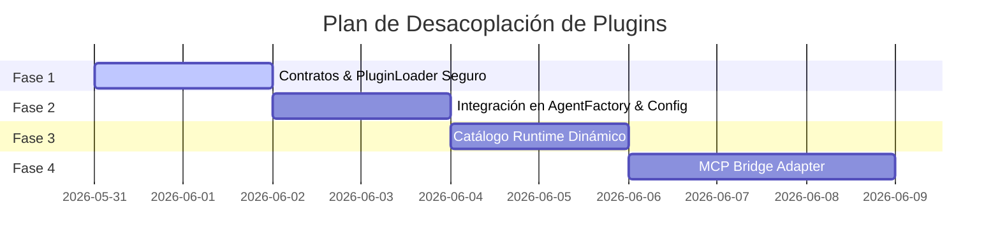

# Arquitectura de Plugins Desacoplables y Model Context Protocol (MCP)

Este documento detalla el diseño técnico para transformar el directorio `plugins/` de un elemento decorativo a la base de un framework altamente modular, desacoplado y seguro, permitiendo especializar al agente para múltiples industrias sin contaminar el `core` del framework.

---

## 🎯 Visión Arquitectónica

El núcleo (`core`) de `AgentFrameWork` actúa estrictamente como un **Orquestador Afecto al Estado** (State-Bound Orchestrator). Sus únicas responsabilidades son:
1. Gestionar el ciclo de vida del agente (`AgentKernel`).
2. Resolver el estado (`StateResolver`).
3. Construir el contexto y el prompt (`ContextBuilder`, `PromptBuilder`).
4. Ejecutar el bucle de razonamiento de N pasos (`FlowEngine`).

Toda capacidad interactiva (lectura de archivos, consultas a base de datos, APIs de terceros, comandos) debe ser un **Plugin externo** cargado en tiempo de ejecución de manera segura y controlada.

---

## 🔒 5 Pilares de Seguridad y Escalabilidad

Para que la modularidad sea robusta y segura en producción, implementamos las siguientes directrices de diseño:

### 1) Contrato de Plugin y Carga Segura
Para evitar problemas de compatibilidad en entornos de producción (donde Node.js puro no puede importar archivos `.ts` en caliente), el runtime **solo importará archivos `.js`** compilados (ej. desde `dist/plugins/` o `plugins/` compilados).

Cada plugin debe exportar una estructura y manifest explícito para validar su integridad antes de registrarlo:

```typescript
export interface PluginContext {
  workspaceRoot: string;
  projectId?: string;
  sessionId?: string;
  config: Record<string, unknown>;
  logger: {
    info(...args: unknown[]): void;
    warn(...args: unknown[]): void;
    error(...args: unknown[]): void;
  };
}

export interface ToolPluginModule {
  manifest: {
    name: string;
    version: string;
    kind: 'tool';
    actionType: string;
  };
  create: (ctx: PluginContext) => Tool;
}
```

### 2) Inicialización con Contexto (`PluginContext`)
Los plugins nunca se instanciarán con un constructor vacío `new PluginModule.default()`. Al cargarse, `AgentFactory` generará un `PluginContext` específico para la sesión y el proyecto del usuario, inyectándolo en la función `create` del plugin. Esto permite a la herramienta acceder de forma segura a su ruta de workspace, configuraciones del entorno, secretos y logger dedicado.

### 3) Seguridad: Allowlist por Workspace (Deny-by-Default)
No existe la auto-carga global descontrolada. El agente solo ganará capacidades que el workspace permita explícitamente.
- Cada proyecto define un archivo `projects/<id>/agent.config.json`.
- Este archivo contiene una lista blanca (`allowlist`) de plugins autorizados y sus configuraciones específicas:
  ```json
  {
    "plugins": {
      "read_file": {
        "enabled": true,
        "config": {
          "maxFileSize": 1048576
        }
      }
    }
  }
  ```
- **PolicyEngine** validará de forma estricta que cualquier `actionType` propuesta por el modelo se encuentre dentro de la lista de herramientas habilitadas y cargadas para esa sesión.

### 4) MCP Bridge: Adaptación Estricta a la Interfaz `Tool`
No se mezcla el protocolo MCP directamente con el núcleo del framework. Se utiliza un adaptador estricto (`MCPToolAdapter`) que implementa la interfaz `Tool` nativa y actúa de puente con el servidor MCP:
- **Nombres con Namespace**: Los nombres de las herramientas del servidor MCP se mapean como `actionType` internos usando un namespace claro: `mcp:<server_name>:<tool_name>` (ej. `mcp:postgres:query_db`).
- **Validación Local**: El adaptador valida los parámetros de entrada localmente contra el `inputSchema` de MCP antes de despachar el comando al servidor externo.
- **Normalización**: El resultado retornado por el servidor MCP se normaliza siempre en un objeto `ToolResult` estándar (`{ success, message, data, error }`).

### 5) Catálogo de Acciones en Runtime Dinámico
Para evitar desalineaciones entre las herramientas activas y las decisiones del parser/generador de prompts:
- **Catálogo Base**: Contiene únicamente las acciones del núcleo del sistema (`send_message`, `none`).
- **Catálogo de Runtime**: Se genera dinámicamente al iniciar una sesión de Workspace cargando solo las herramientas en la `allowlist`.
- **Inyección de Prompts**: El `PromptBuilder` y `DecisionParser` consumen este catálogo dinámico de runtime para construir las instrucciones de herramientas disponibles en el prompt y validar sintácticamente las decisiones propuestas.

---

## 📈 Plan de Implementación Recomendado



1. **Infraestructura de Plugin Contract + Loader Seguro**:
   - Creación de `core/plugins/contracts.ts` y `core/plugins/PluginLoader.ts`.
   - Implementación de la validación de módulos compilados `.js` y captura segura de errores de importación.
2. **Workspace Config & Integración en AgentFactory**:
   - Definición del esquema `projects/<id>/agent.config.json` con `allowlist` por proyecto.
   - Quitar la importación cableada de `ReadFileTool` de `AgentFactory.ts` y cargarla basándose en la configuración del workspace.
3. **Catálogo de Acciones en Runtime**:
   - Hacer dinámico el catálogo para que `PromptBuilder` renderice las herramientas correctas y `DecisionParser`/`PolicyEngine` validen contra las herramientas activas.
4. **MCP Bridge (MCPClient & MCPToolAdapter)**:
   - Desarrollar la conexión stdio con servidores MCP y el mapeo namespaced a `Tool` local.

---

## ⚠️ Mitigación de Riesgos Críticos

| Riesgo | Mecanismo de Bloqueo / Mitigación |
| :--- | :--- |
| **Ejecución de Código Arbitrario** | Validación estricta del manifest del plugin antes de su registro y aislamiento de paths en el `PluginLoader`. |
| **Incompatibilidad Dev/Prod (TS vs JS)** | Prohibir imports de archivos `.ts` en caliente; el cargador solo lee extensiones `.js` construidas en la carpeta de distribución. |
| **Desalineación de Capacidades** | El catálogo dinámico de runtime es la fuente única de verdad para el prompt, el parser de decisiones, y el motor de políticas. |
| **Fuga de Contexto/Rutas** | Validación en el constructor de cada herramienta usando el `PluginContext.workspaceRoot` inyectado, impidiendo accesos fuera del directorio asignado. |
